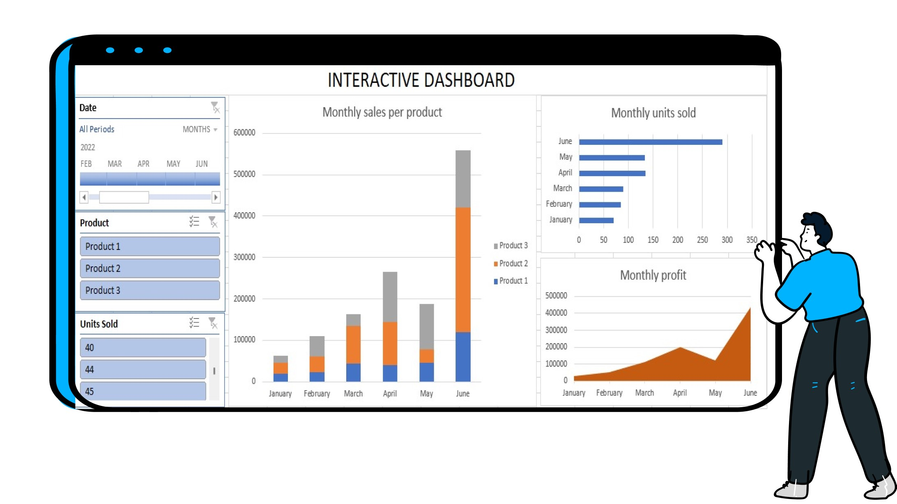

# Belly Button Biodiversity Dashboard


This project is an interactive dashboard that explores the Belly Button Biodiversity dataset, which catalogs the microbes found in human navels. The dataset reveals that a small number of microbial species (operational taxonomic units, or OTUs) are found in more than 70% of individuals, while others are relatively rare.

## Project Overview
The Belly Button Biodiversity Dashboard allows users to:
- Select a test subject ID from a dropdown menu.
- View a bar chart that displays the top 10 bacterial species (OTUs) found in that individual.
- View a bubble chart representing the entire microbial profile of the selected individual.
- Display demographic metadata, such as ethnicity, age, and location for the selected subject.

The dashboard is interactive and updates all plots dynamically when a new test subject is selected from the dropdown menu.



## Features
### Bar Chart
- **Purpose:** Display the top 10 OTUs found in each test subject.
- **Values:** The `sample_values` field is used to represent the OTU values.
- **Labels:** The `otu_ids` field is used to label each bar.
- **Hover Text:** The `otu_labels` field is displayed as hover text for each bar.

### Bubble Chart
- **Purpose:** Show the microbial profile for each test subject.
- **X Values:** The `otu_ids` field represents the x-axis values.
- **Y Values:** The `sample_values` field is used for the y-axis values.
- **Marker Size:** The `sample_values` field is used to determine the size of each bubble.
- **Marker Color:** The `otu_ids` field is used to determine the color of each bubble.
- **Hover Text:** The `otu_labels` field is displayed when hovering over a bubble.

### Metadata Panel
- Displays the demographic information of the selected test subject. This includes:
  - **Ethnicity**
  - **Gender**
  - **Age**
  - **Location**
  - **Belly button type (Innie or Outie)**
  - **Washing frequency (wfreq)**

### Dynamic Updates
- When a new test subject is selected, both the bar chart and bubble chart update to show the relevant OTUs and microbial profile.
- The demographic metadata panel also updates with information about the newly selected test subject.

## Project Structure
```
belly-button-challenge/
│
├── static/
│   └── js/
│       └── app.js         # Contains JavaScript logic for fetching data and rendering charts.
├── samples.json            # The dataset containing microbial profiles and metadata for test subjects.
├── index.html              # The main HTML file that structures the dashboard.
└── README.md               # This file.
```

## Data Source
The dataset is hosted online and includes:
1. **Names:** A list of test subject IDs.
2. **Metadata:** Demographic data, such as age, gender, location, and washing frequency (`wfreq`) for each test subject.
3. **Samples:** Microbial profile data for each test subject, including OTU IDs, OTU labels, and sample values.

The data is accessed using D3.js and loaded dynamically into the dashboard.


## Technologies Used
- **HTML/CSS/Bootstrap**: For structuring and styling the dashboard.
- **JavaScript (ES6)**: For interactivity and DOM manipulation.
- **D3.js**: For fetching data and rendering charts.
- **Plotly.js**: For creating interactive and responsive charts.

## JavaScript Logic (app.js)
- **`buildMetadata(sample)`**: This function fetches the metadata for the selected test subject and displays it in the demographic panel.
- **`buildCharts(sample)`**: This function generates both the bar chart (top 10 OTUs) and the bubble chart (microbial profile) for the selected test subject.
- **`init()`**: Initializes the dashboard by populating the dropdown menu with the test subject IDs and rendering the default charts and metadata for the first test subject.
- **`optionChanged(newSample)`**: This event handler updates the charts and metadata whenever a new test subject is selected.

## Conclusion
This project offers an insightful way to explore the Belly Button Biodiversity dataset through an interactive and user-friendly dashboard. By selecting different test subjects, users can quickly visualize and compare the microbial profiles of various individuals. The combination of bar and bubble charts, along with demographic information, provides a comprehensive view of the data in an engaging format.

